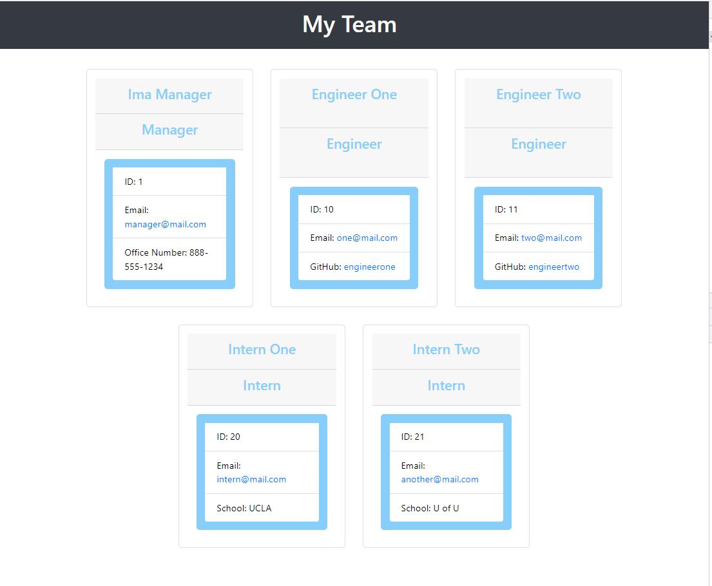

# Team Profile Generator

## Table of Contents 
- [Description](#description) 
- [Installation](#installation) 
- [Usage](#usage) 
- [License](#license) 
- [Contributing](#contributing) 
- [Tests](#tests) 
- [Questions](#questions) 
## Description 
Allows a managers to enter the information oabout their employees and generates a simple web page to easily access the information.   

(https://watch.screencastify.com/v/hP5TELHyL4QKuwc1iqwv "Presentation Video")

## Installation 
run "npm install" after downloading form git repository   
## Usage 
Application is launched using "node index.js" in the application directory.  
## License 

 This application is covered by the MIT license.
 ## Contributing 
Lewis Holgate   
## Tests 
Tests were run using "jest" to verify the classes.  
 PASS  __test__/Intern.test.js  
PASS  __test__/Manager.test.js  
PASS  __test__/Engineer.test.js  
PASS  __test__/Employee.test.js  
## Questions 
For questions or comments contact developer at below links.   
 Find me on GitHub: [lholgate](https://github.com/lholgate) 
Email me with any questions: lholgate6162@gmail.com 
